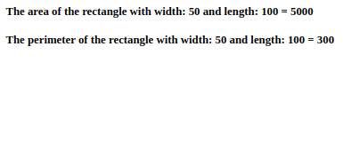
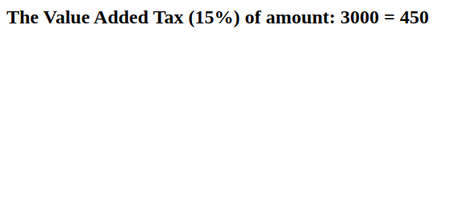
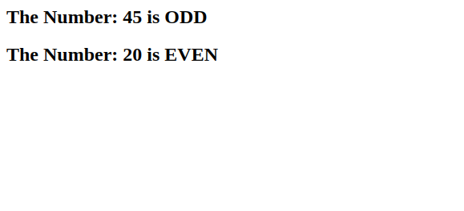
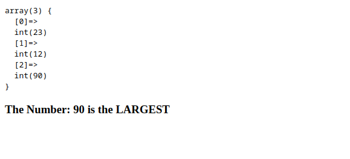
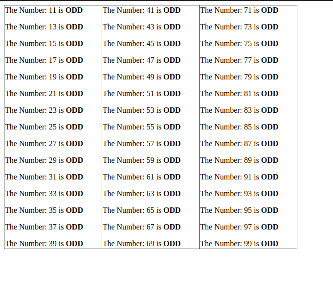
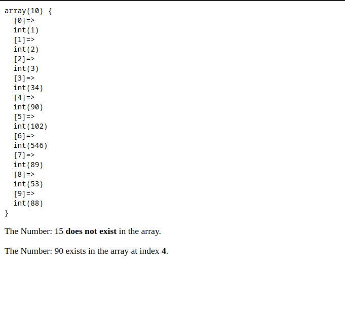
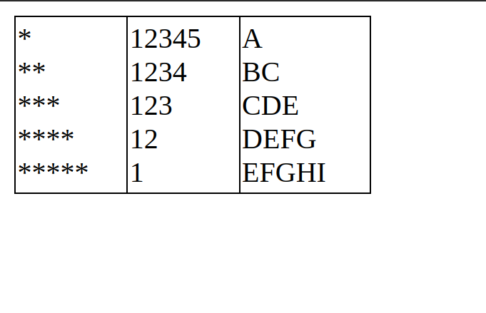
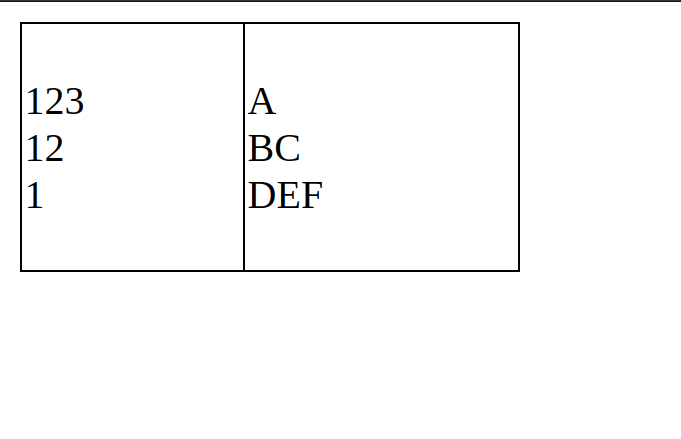

# Lab 03

## Task1.php
Write a PHP script to calculate the area and perimeter of a Rectangle, and display the result.

## Task2.php
Write a PHP script to calculate the VAT (Value Added Tax) over an amount.

## Task3.php
Write a PHP script to find whether a given number is odd or even.

## Task4.php
Write a PHP script to find the largest number from three given numbers.

## Task5.php
Write a PHP script to print all the odd numbers between 10 and 100.

## Task6.php
Write a PHP script to search an element from an array.

## Task7.php
Print shapes using nested loops.

## Task8.php
Declare a 2D array and print shapes.

